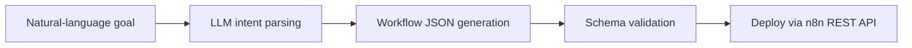

# n8n Workflow Agent

**Type a goal in plain language, get a validated n8n workflow JSON, and deploy it to a live n8n instance with one click.**

      



## Problem it solves

Building n8n workflows means knowing node names, parameters and connection rules. This agent generates the workflow from a description, validates it and pushes it through the n8n REST API.

AI-powered n8n workflow generator. Type a natural language prompt → get a complete, deployment-ready n8n workflow JSON — and push it to your running n8n instance with one click.

## What It Does

1. You type: *"send me an email every day at 9am with the latest Bitcoin price"*
2. The agent parses the intent using GPT-4o or Claude
3. It generates a valid n8n workflow JSON with correct nodes, parameters, and connections
4. You deploy it to your running n8n instance via the n8n REST API
5. Done — your workflow is live

## Quick Start

### Option A — Docker Compose (includes n8n)

```bash
cp .env.example .env
# Add your OpenAI or Anthropic API key to .env
docker compose up -d
```

n8n will be at http://localhost:5678
Agent API at http://localhost:8000

### Option B — Local Development

```bash
python -m venv .venv
source .venv/bin/activate  # or .venv\Scripts\activate on Windows
pip install -r requirements.txt

cp .env.example .env
# Edit .env with your API keys

python main.py        # Starts FastAPI + Flet desktop UI
# or
python main.py --api-only   # API server only (no Flet)
```

## Example Prompts

The agent understands natural language — try these:

```
"Send me an email every day at 9am with the latest Bitcoin price"
"Create a workflow that fetches crypto prices every hour and sends to Telegram"
"When a webhook is received, call OpenAI API and respond with the AI answer"
"Every weekday at 8am, fetch sales data from an API and email a report"
"Monitor a webhook and forward notifications to Discord"
"Read emails from inbox and save them to a Notion database"
"Every Monday at 7am, fetch the top RSS news and email a digest"
"Create a Slack alert when the Bitcoin price drops below $50,000"
"Fetch data from my API every 5 minutes and append to Google Sheets"
"Accept a chat message via webhook, send to GPT-4o, and return the response"
```

## Features

### Prompt → Workflow
- Type any description → AI generates complete n8n JSON
- Supports OpenAI GPT-4o and Anthropic Claude
- Validates output before accepting
- Auto-fixes common structural issues

### Visual Editor
- Node list with type icons and parameter preview
- Inline parameter editing (JSON mode)
- Connection flow diagram
- Add/remove nodes
- Save and deploy from the editor

### Workflow Library
- All generated workflows saved locally (SQLite)
- Search by name or prompt
- Export as JSON file
- Import from JSON (from n8n or manual)
- Built-in templates for 6 common workflows

### n8n Integration
- Connect to any running n8n instance
- Deploy with one click → POST /api/v1/workflows
- Activate / deactivate workflows
- List and delete workflows from the n8n UI
- View credentials registered in n8n

### Built-in Templates (no LLM required)
| Template | Description |
|---|---|
| Crypto Price Alert | CoinGecko → Telegram, hourly |
| Email to Notion | IMAP inbox → Notion database |
| Daily Report Email | API → Code (format) → SMTP, weekdays |
| Webhook to Discord | POST webhook → Discord channel |
| RSS Feed to Email | BBC RSS → Email digest, daily |
| AI Chat Simple | Chat trigger → GPT-4o → respond |

## n8n Node Reference

The agent knows how to generate valid configs for all these nodes:

### Triggers
| Node Type | Key | Description |
|---|---|---|
| `n8n-nodes-base.start` | `start` | Manual start |
| `n8n-nodes-base.webhook` | `webhook` | HTTP POST/GET trigger |
| `n8n-nodes-base.scheduleTrigger` | `scheduleTrigger` | Cron or interval |
| `n8n-nodes-base.chatTrigger` | `chatTrigger` | Chat interface trigger |

### Actions
| Node Type | Key | Description |
|---|---|---|
| `n8n-nodes-base.httpRequest` | `httpRequest` | Any HTTP API call |
| `n8n-nodes-base.emailSend` | `emailSend` | Send email via SMTP |
| `n8n-nodes-base.emailReadImap` | `emailReceive` | Read from IMAP mailbox |
| `n8n-nodes-base.telegram` | `telegram` | Telegram Bot message |
| `n8n-nodes-base.slack` | `slack` | Slack channel message |
| `n8n-nodes-base.discord` | `discord` | Discord webhook/bot |
| `n8n-nodes-base.notion` | `notion` | Notion page/database |
| `n8n-nodes-base.googleSheets` | `googleSheets` | Google Sheets read/write |
| `n8n-nodes-base.openAi` | `openAi` | OpenAI completions |
| `n8n-nodes-base.respondToWebhook` | `respondToWebhook` | Respond to webhook caller |

### Logic
| Node Type | Key | Description |
|---|---|---|
| `n8n-nodes-base.if` | `if` | Conditional branch |
| `n8n-nodes-base.switch` | `switch` | Multi-output branch |
| `n8n-nodes-base.code` | `code` | JavaScript code |
| `n8n-nodes-base.set` | `set` | Set/transform fields |
| `n8n-nodes-base.wait` | `wait` | Delay/pause |
| `n8n-nodes-base.splitInBatches` | `splitInBatches` | Batch processing |
| `n8n-nodes-base.merge` | `merge` | Merge branches |

### Schedule Trigger Examples
```json
// Every day at 9am
{ "rule": { "interval": [{ "field": "cronExpression", "expression": "0 9 * * *" }] } }

// Every hour
{ "rule": { "interval": [{ "field": "hours", "hoursInterval": 1 }] } }

// Every 30 minutes
{ "rule": { "interval": [{ "field": "minutes", "minutesInterval": 30 }] } }

// Every weekday at 8am
{ "rule": { "interval": [{ "field": "cronExpression", "expression": "0 8 * * 1-5" }] } }
```

## API Reference

The FastAPI server runs at `http://localhost:8000`.

### Generate Workflow
```bash
POST /generate
{
  "prompt": "send Bitcoin price to Telegram every hour",
  "llm_provider": "openai",
  "llm_model": "gpt-4o"
}
```

### List Saved Workflows
```bash
GET /workflows?limit=50&offset=0&search=crypto
```

### Deploy to n8n
```bash
POST /workflows/{id}/deploy
{ "activate": false }
```

### Import JSON
```bash
POST /import
{
  "name": "My Workflow",
  "workflow_json": { ... },
  "prompt": "Imported from n8n"
}
```

### List Templates
```bash
GET /templates
GET /templates/{id}
POST /templates/{id}/use
```

### n8n Instance
```bash
GET  /n8n/health
GET  /n8n/workflows
DELETE /n8n/workflows/{id}
GET  /n8n/credentials
```

### Settings
```bash
GET /settings
PUT /settings
{
  "n8n_base_url": "http://localhost:5678",
  "n8n_api_key": "your-key",
  "llm_provider": "openai",
  "llm_model": "gpt-4o",
  "llm_temperature": 0.1,
  "default_timezone": "UTC"
}
```

## n8n Workflow JSON Format

The agent generates JSON matching n8n's exact expected format:

```json
{
  "name": "Workflow Name",
  "nodes": [
    {
      "id": "uuid-string",
      "name": "Node Name",
      "type": "n8n-nodes-base.httpRequest",
      "typeVersion": 4,
      "position": [250, 300],
      "parameters": { "method": "GET", "url": "..." },
      "disabled": false
    }
  ],
  "connections": {
    "Source Node Name": {
      "main": [[{ "node": "Target Node Name", "type": "main", "index": 0 }]]
    }
  },
  "pinData": {},
  "versionId": "uuid",
  "active": false,
  "settings": { "executionOrder": "v1" },
  "tags": [],
  "staticData": null
}
```

## Configuration

All configuration via environment variables or `.env` file:

| Variable | Default | Description |
|---|---|---|
| `LLM_PROVIDER` | `openai` | `openai` or `anthropic` |
| `LLM_MODEL` | `gpt-4o` | Model name |
| `LLM_TEMPERATURE` | `0.1` | Lower = more deterministic |
| `OPENAI_API_KEY` | — | OpenAI API key |
| `ANTHROPIC_API_KEY` | — | Anthropic API key |
| `N8N_BASE_URL` | `http://localhost:5678` | n8n instance URL |
| `N8N_API_KEY` | — | n8n API key (if enabled) |
| `DATABASE_URL` | SQLite in `./data/` | Async SQLAlchemy URL |
| `API_HOST` | `127.0.0.1` | FastAPI host |
| `API_PORT` | `8000` | FastAPI port |
| `DEFAULT_TIMEZONE` | `UTC` | Schedule default timezone |

## Running Tests

```bash
pip install pytest pytest-asyncio
pytest tests/ -v
```

## Project Structure

```
n8n-workflow-agent/
├── main.py                    # Entry: FastAPI + Flet launcher
├── requirements.txt
├── docker-compose.yml
├── Dockerfile
├── .env.example
├── src/
│   ├── config.py              # Pydantic Settings
│   ├── database.py            # SQLAlchemy async
│   ├── models.py              # ORM models
│   ├── schemas.py             # Pydantic v2 schemas
│   ├── api_server.py          # FastAPI routes
│   ├── workflow_generator.py  # LLM → n8n JSON
│   ├── n8n_client.py          # REST client for n8n API
│   ├── workflow_validator.py  # Validates generated JSON
│   ├── node_templates.py      # All supported node types
│   ├── templates.py           # 6 pre-built templates
│   ├── export.py              # JSON export/import
│   └── ui/
│       ├── app.py             # Flet shell + navigation
│       ├── components.py      # Shared: node card, diagram, colors
│       ├── prompt_view.py     # Main: prompt → workflow
│       ├── editor_view.py     # Visual node editor
│       ├── library_view.py    # Saved workflows + templates
│       ├── instance_view.py   # n8n instance management
│       └── settings_view.py   # Config: URL, keys, LLM
└── tests/
    ├── test_validator.py
    ├── test_generator.py
    └── test_n8n_client.py
```

## Stack

- **LLM**: OpenAI GPT-4o (JSON mode) / Anthropic Claude
- **Backend**: FastAPI + uvicorn (async)
- **Database**: SQLite (default) / PostgreSQL
- **Desktop UI**: Flet (dark theme, Flutter-powered)
- **n8n**: REST API integration

## License

MIT
